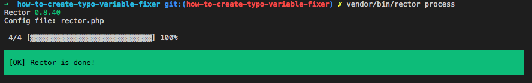
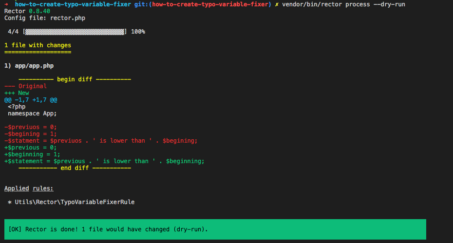
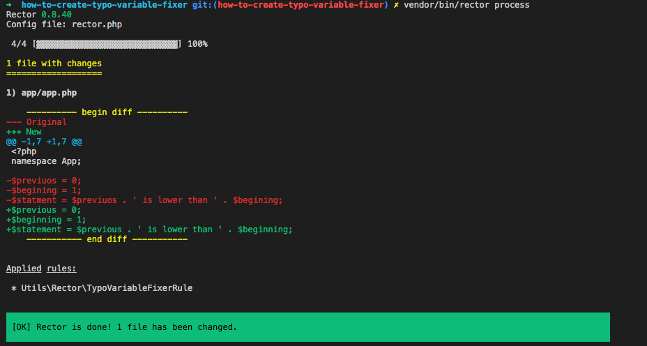

How to Create Typo Variable Fixer with Rector
=============================================

[Rector](https://github.com/rectorphp/rector) is a code refactoring tool that can help us with major code changes (like upgrade legacy code) or daily work. There are already [many rules](https://github.com/rectorphp/rector/blob/master/docs/rector_rules_overview.md) that ready to use for us.

What if we want a custom rule, like we want a daily work can to do "Typo" check in variables? In this post, I want to show you how to create a Typo Variable Fixer with Rector, a custom Rector rule!

Preparation
-----------

First, let say, we build a new `app`, we use composer for it:

```php
composer init


  Welcome to the Composer config generator


This command will guide you through creating your composer.json config.

Package name (<vendor>/<name>) [samsonasik/how-to-create-typo-variable-fixer]: samsonasik/app

Description []: App Demo

Author [Abdul Malik Ikhsan <samsonasik@gmail.com>, n to skip]:

Minimum Stability []:

Package Type (e.g. library, project, metapackage, composer-plugin) []:

License []: MIT

Define your dependencies.

Would you like to define your dependencies (require) interactively [yes]? no
Would you like to define your dev dependencies (require-dev) interactively [yes]? yes
Search for a package: rector/rector
Enter the version constraint to require (or leave blank to use the latest version):

Using version ^0.8.40 for rector/rector

Search for a package:

{
    "name": "samsonasik/app",
    "description": "App Demo",
    "require-dev": {
        "rector/rector": "^0.8.40"
    },
    "license": "MIT",
    "authors": [
        {
            "name": "Abdul Malik Ikhsan",
            "email": "samsonasik@gmail.com"
        }
    ],
    "require": {}
}

Do you confirm generation [yes]? yes
Would you like to install dependencies now [yes]? yes
```

After it, let say we need an `app` directory, we can create an `app` directory and write a `php` file inside it:

```bash
mkdir -p app && touch app/app.php
```

with file `app/app.php` content:

```php
<?php

namespace App;

$previuos = 0;
$begining = 1;
$statment = $previuos . ' is lower than ' . $begining;
```

Yes, there are 3 typos in above file! For example, we will have a sample `library.php` file for common typos, for example, inside `utils` directory:

```bash
mkdir -p utils && touch utils/library.php
```

with file `utils/library.php` content:

```php
<?php

namespace Utils;

return [
    'previous' => ['previuos', 'previuous'],
    'beginning' => ['begining', 'beginign'],
    'statement' => ['statment'],
];
```

We can setup composer autoload for with add the following to our `composer.json` file:

```javascript
    "autoload": {
        "psr-4": {
            "App\\": "app"
        }
    },
    "autoload-dev": {
        "psr-4": {
            "Utils\\": "utils"
        }
    }
```

After it, run composer dump-autoload command:

```bash
composer dump-autoload
```

The preparation is done!

Create the Typo Fixer Rule
--------------------------

We can follow the `Rector`'s [documentation to create new custom rule](https://github.com/rectorphp/rector/blob/10ae0d687ab65bec4a80752ed7f0a04c208a684f/docs/create_own_rule.md). So, for example, we create `TypoVariableFixerRule` under own `utils/Rector` directory:

```bash
mkdir -p utils/Rector && touch utils/Rector/TypoVariableFixerRule.php
```

Our directory will looks like the following:

```bash
.
├── app
│   └── app.php
├── composer.json
├── utils
│   ├── Rector
│   │   └── TypoVariableFixerRule.php
│   └── library.p
```

Now, we can start create the `TypoVariableFixerRule`:

```php
<?php

declare(strict_types=1);

namespace Utils\Rector;

use PhpParser\Node;
use PhpParser\Node\Expr\Variable;
use Rector\Core\Rector\AbstractRector;
use Rector\Core\RectorDefinition\CodeSample;
use Rector\Core\RectorDefinition\RectorDefinition;

final class TypoVariableFixerRule extends AbstractRector
{
    public function getNodeTypes(): array
    {
        return [Variable::class];
    }

    /**
     * @param Variable $node
     */
    public function refactor(Node $node): ?Node
    {
        return $node;
    }

    public function getDefinition(): RectorDefinition
    {
        return new RectorDefinition(
            'Change Typo in variable', [
                new CodeSample(
                    // code before
                    '$previuos',
                    // code after
                    '$previous'
                ),
            ]
        );
    }
}
```

Above, we extends `AbstractRector` for new Rector rule. We operate with [`nikic/php-parser`](https://github.com/nikic/PHP-Parser) to do refactor. Before we continue, let's register our new `TypoVariableFixerRule` to rector config to ensure it works. We can create rector config as follow:

```bash
touch rector.php
```

with file `rector.php` content:

```php
<?php

use Rector\Core\Configuration\Option;
use Symfony\Component\DependencyInjection\Loader\Configurator\ContainerConfigurator;
use Utils\Rector\TypoVariableFixerRule;

return static function (ContainerConfigurator $containerConfigurator): void {
	$parameters = $containerConfigurator->parameters();
	$parameters->set(Option::PATHS, [__DIR__ . '/app']);

	$services = $containerConfigurator->services();
	$services->set(TypoVariableFixerRule::class);
};
```

and test with run ``

```bash
vendor/bin/rector process
```

So we see the "Green" OK:



Now, time to make `refactor` work! We can modify the `refactor` method:

```php
    public function refactor(Node $node): ?Node
    {
        // get the variable name
        $variableName = $this->getName($node);

        // get the library content
        $library = include 'utils/library.php';

        foreach ($library as $correctWord => $commonTypos) {
            if (! in_array($variableName, $commonTypos, true)) {
                continue;
            }

            return new Variable($correctWord);
        }

        return null;
    }
```

Above, we find if the variable name is in common typos, then we return with new Variable with the correct word. Now, let's run it with `--dry-run` to see the diff that can be made:

```bash
vendor/bin/rector process --dry-run
```

and we can see:



Seems great! Let's apply the changes:

```bash
vendor/bin/rector process
```



Awesome! We now already make typo fixer succesfully working! Let's run again, and it will take no effect as already fixed:


That's it!